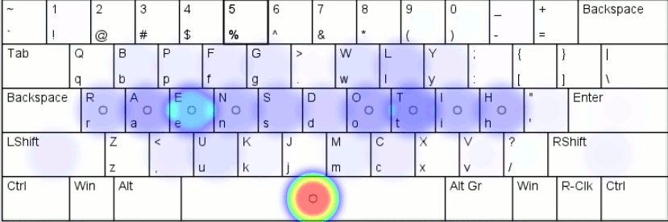

# Keymacs — the keyboard layout for Emacs users

Like in many other alternative layouts first purpose of this project is
fix QWERTY problems. Second purpose is to be compatible with most typical
GNU/Emacs keybindings.

An usable keyboard layout for all purposes is a mythical idea similar
to idea of an universal programming language. A degree of usability
always depends on UI of applications you used. Different apps have
different frequency of key combinations and provide different hotkeys.
Human languages beside English increase complexity of this task
by adding own rules of keyboard usage unique per language. Also
hardware limits of common keyboards prevent to use them ergonomically
(there are a very small set of keyboards that may be called really
ergonomic).

But with all these limitations in mind it is possible to increase
usability of your keyboard for most often used by you applications
and for languages you speak. And I think resulting layout, that may be
comfortable for you will be very different from layout comfortable for me.
But... if we use nearly same set of applications and speak same language
then optimal for us layouts may be similar too. So it is main idea of this
project — *it is not possible make universal ergonomic layout for all* but
it possible make *nearly ergonomic layout* for people who used *similar tools
and speak same language*.

Yes, it possible to change keybindings in different apps to a single scheme.
But anyway adapting you keybindings will not improve QWERTY layout. So you
will choose one of alternatives like Colemak, Norman, Workman etc. But then
you will try to use it with your honest application you will find how strange
look old key combos. Especially navigation on chars/words/strings or copypasting.
For example Colemak keeps ZXCV keys in same places like in QWERTY so you will
not lost with a new layout in many GUI apps those use these keys for copy-paste
operations. But if you are Vi or Emacs user you will find a new layout very
uncomfortable for the most of typical operations because default keybindings
was oriented on QWERTY. As another example remember navigation keys in Vim:
where they placed in QWERTY and just compare with any other alternative layout.
You will find them in very inconvenient places. So if you want to use better
keyboard layout you will need change applications you use for that layout.

It main cause why I not use one of ready alternatives and research for own
solution. Because I used GNU/Emacs most of time and terminals with Emacs-like
keybindings. I also try to set Emacs keybindings in other programs where possible.
And most of time I wrote texts in English (programming languages and docs).
So with Keymacs I got layout better on many ergonomic parameters than QWERTY and
keys placement well suited for Emacs keybindings.

So it is chance that if you use Emacs and apps with Emacs-like bindings than my
keyboard layout may be good for you too :) 

## Why is it good for Emacs?

TBD

Motivation for placement all these keys on such different from QWERTY places
of cource need explanations. Explanations need significantly more time. I have
no this time currently. So it will be done later.

### Heatmaps

There are results from [patorjk.com/keyboard-layout-analyzer](http://patorjk.com/keyboard-layout-analyzer/) for
the configuration [keyboard-analyzer-config.json](keyboard-analyzer-config.json):

### Top of the most frequent letter pairs in English texts

* TH — at home row in Keymacs, not need finger movement `[+]`
* HE — at home row in Keymacs, not need finger movement `[+]`
* AN — at home row in Keymacs, not need finger movement `[+]`
* IN — at home row in Keymacs, but need the same finger `[-]`
* ER — at home row in Keymacs, not need finger movement `[+]`
* ND — at home row in Keymacs `[+/-]`
* RE — at home row in Keymacs, not need finger movement `[+]`
* ED — at home row in Keymacs `[+/-]`
* ES — at home row in Keymacs, not need finger movement `[+]`
* OU — need finger movement `[-]`
* TO — at home row in Keymacs, not need finger movement `[+]`
* HA — at home row in Keymacs, not need finger movement `[+]`
* EN — at home row in Keymacs, not need finger movement `[+]`
* EA — at home row in Keymacs, not need finger movement `[+]`
* ST — at home row in Keymacs, not need finger movement `[+]`
* NT — at home row in Keymacs, not need finger movement `[+]`
* ON — at home row in Keymacs, not need finger movement `[+]`
* AT — at home row in Keymacs, not need finger movement `[+]`
* HI — need finger movement `[-]`
* AS — at home row in Keymacs, not need finger movement `[+]`

For compare QWERTY only had *AS* pair placed at home row, but
all other pairs from the list above need move either one finger.

In Keymacs most of time you will use home row of your keyboard
(carpalx simulator shows >70% of home row usage on default
corpus of English texts).

### Navigation keys

Emacs by default uses holding Control and pressing `F` `B` for
navigating right-left and `P` `N` for navigating up-down.
It is easy for remember because of mnemomic names but not very
good placed on QWERTY. Keymacs places all these keys for one
hand usage (under a left hand). Statistically the most used
navigation key in Emacs is moving cursor down so it placed
in home row without a finger movement (`N`).

For the list of the most often pressed key combinations in Emacs
I used statistics results from
[ergoemacs.org/emacs/command-frequency.html](http://ergoemacs.org/emacs/command-frequency.html).

### State of the project

This my research for the best keyboard continues a long time (I started with my fully custom keyboard circa 2014 and
earlier I tried another layouts from the net). And it is far from finish.
Though I already got much more comfortable layout for my needs than default but it still has
a lot of drawbacks. So I can't recommend to use it. But I hope my results may inspire you to find your own
right path to ideal.

### Carpalx results for the layout

    Keyboard effort                                             
    ------------------------------------------------------------
    k1                      0.788  76.9  76.9                   
    k1,k2                   0.992  19.9  96.8                   
    k1,k2,k3                1.025   3.2 100.0                   
    b                       0.356  19.3  19.3                   
    p                       0.670  36.4 153.1                   
    ph                      0.000   0.0   0.0                   
    pr                      0.166  24.8  24.8                   
    pf                      0.431  64.4  89.2                   
    s                       0.813  44.2 100.0                   
    all                     1.838 100.0 100.0                   
                                                                
    #data effort_k1=>[0.788,76.868,76.868],                     
    #data effort_k12=>[0.992,19.923,96.790],                    
    #data effort_k123=>[1.025,3.210,100.000],                   
    #data effort_base=>[0.356,19.345,19.345],                   
    #data effort_penalty=>[0.670,36.428,153.104],               
    #data effort_penalty_hand=>[0.000,0.000,0.000],             
    #data effort_penalty_row=>[0.166,24.800,24.800],            
    #data effort_penalty_finger=>[0.431,64.438,89.238],         
    #data effort_path=>[0.813,44.227,100.000],                  
    #data effort_all=>[1.838,100.000,100.000],                  
                                                                
    keyboard row frequency                                      
    ------------------------------------------------------------
    1                     1483367 16.2  16.2                    
    2                     6734080 73.6  89.8                    
    3                      933718 10.2 100.0                    
                                                                
    #data row_data=>[qw(1 2 3)],                                
    #data row_frequency=>[0.162,0.736,0.102],                   
    #data row_cumulative=>[0.162,0.898,1.000],                  
                                                                
    keyboard hand frequency                                     
    ------------------------------------------------------------
    0                     4711673 51.5  51.5                    
    1                     4439492 48.5 100.0                    
                                                                
    #data hand_data=>[qw(0 1)],                                 
    #data hand_frequency=>[0.515,0.485],                        
    #data hand_cumulative=>[0.515,1.000],                       
                                                                
    keyboard finger frequency                                   
    ------------------------------------------------------------
    0                      539877  5.9   5.9                    
    1                      895424  9.8  15.7                    
    2                     1540730 16.8  32.5                    
    3                     1735642 19.0  51.5                    
    6                     1806945 19.7  71.2                    
    7                     1211914 13.2  84.5                    
    8                      854357  9.3  93.8                    
    9                      566276  6.2 100.0                    

## Known problems

* Position of `N` `I` pair is bad for high frequency English pair "IN" because these both keys pressed by the left index finger.
* Navigation block need more tests (all keys ←↓↑→ on one hand VS splitted ↓↑ on left and ←→ on right).

## Separated navigation layer

TBD
