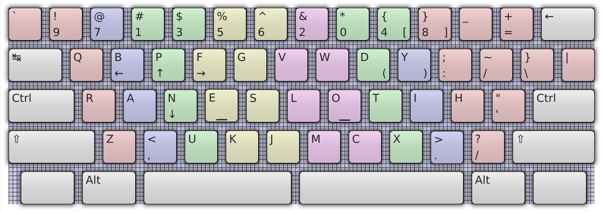
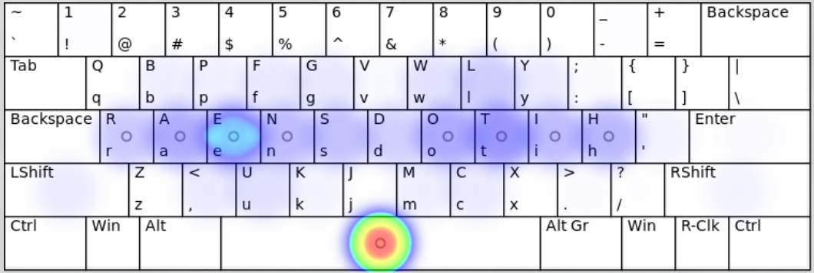

# Keymacs — the keyboard layout for Emacs users

## Project targets

* Fix QWERTY problems (apply solutions from well known alternative layouts).
* Place keys for general Emacs combos into convenient places instead of remapping them in Emacs.

Like in many other alternative layouts first purpose of this project
is fix QWERTY problems. Second purpose is to be compatible with most
typical GNU/Emacs keybindings. 

### Problems with familiar keys bindings in alternative keyboards

Commonly the most alternative layouts solve only first problem
mentioned above: they help you avoid inconvenience of QWERTY. But they
require you remap the most of known Emacs keys for different modes
because these layouts was made without Emacs in mind. For example
several well known layouts try keep `XCV` keys in convenient place (or
in the same place as QWERTY) because historically many applications on
the desktop platforms (Windows, Mac, Linux) use these keys for
clipboard operations. So it is a strong habit of computer users that
even alternative layouts wont break it. But Emacs uses other keys for
clipboard by default: `Ctl`-`W` for cut, `Meta`-`W` for copy and
`Ctl`-`Y` for insert. I think these keys badly placed on QWERTY. But
on Dvorak layout they placed even worse on my sense. Norman layout
places them in more accessible places though. But anyway alternative
layouts targeted at mostly used apps (like word processors and well
known browsers) those keyboard combos very different from habits
suggested by Emacs. So my try is create the layout oriented primarily
on Emacs experience.

The same problem appears for Emacs navigation keys on alternative
layouts. So if you want to use better keyboard layout you will need
adapt for the layout all your Emacs bindings and bindings in the
applications that use Emacs-like bindings (shell for example).

## Application oriented layout

I think an usable keyboard layout for all purposes is a mythical idea
similar to idea of an universal programming language. A degree of
usability always depends on UI of applications you used. Different
apps have different frequency of key combinations and provide
different hotkeys.  Human languages beside English increase complexity
of this task by adding own rules of keyboard usage unique per
language. Also hardware limits of common keyboards prevent to use them
ergonomically (there are a very small set of keyboards that may be
called really ergonomic).

But with all these limitations in mind it is possible to increase
usability of your keyboard for most often used by you applications and
for languages you speak. And I think resulting layout, that may be
comfortable for you will be very different from layout comfortable for
me.  But if we use nearly same set of applications and speak same
language then layouts that optimal for us may be similar too. So it is
main idea of this project — *it is not possible make universal
ergonomic layout for all purposes* but it possible make *nearly
ergonomic layout* for people who used *the same tools*.

It main cause why I not use one of ready alternatives and research for
own solution. Because I used GNU/Emacs most of time and terminals with
Emacs-like keybindings. I also try to set Emacs keybindings in other
programs where possible.  And most of time I wrote texts in English
(programming languages and docs).  So with Keymacs I got layout better
on many ergonomic parameters than QWERTY and keys placement well
suited for Emacs bindings.

So it is chance that if you use Emacs and apps with Emacs-like
bindings than my keyboard layout may be good for you too :)

## Why is it good for Emacs?

TBD

Motivation for placement all these keys on such different from QWERTY
places of cource need explanations. Explanations need significantly
more time. I have no this time currently. So it will be done later.

### Heatmaps

There are results from [patorjk.com/keyboard-layout-analyzer](http://patorjk.com/keyboard-layout-analyzer/) for
the configuration [keyboard-analyzer-config.json](keyboard-analyzer-config.json):

Compare with QWERTY layout: 

### Top of the most frequent letter pairs in English texts

* TH — at home row in Keymacs, not need finger movement `[+]`
* HE — at home row in Keymacs, not need finger movement `[+]`
* AN — at home row in Keymacs, not need finger movement `[+]`
* IN — at home row in Keymacs, not need finger movement `[+]`
* ER — at home row in Keymacs, not need finger movement `[+]`
* ND — at home row in Keymacs `[+/-]`
* RE — at home row in Keymacs, not need finger movement `[+]`
* ED — at home row in Keymacs `[+/-]`
* ES — at home row in Keymacs `[+/-]`
* OU — need finger movement `[-]`
* TO — at home row in Keymacs, not need finger movement `[+]`
* HA — at home row in Keymacs, not need finger movement `[+]`
* EN — at home row in Keymacs, not need finger movement `[+]`
* EA — at home row in Keymacs, not need finger movement `[+]`
* ST — at home row in Keymacs `[+/-]`
* NT — at home row in Keymacs, not need finger movement `[+]`
* ON — at home row in Keymacs, not need finger movement `[+]`
* AT — at home row in Keymacs, not need finger movement `[+]`
* HI — at home row in Keymacs, not need finger movement `[+]`
* AS — at home row in Keymacs `[+/-]`

For compare QWERTY only had *AS* pair placed at home row, but
all other pairs from the list above need move either one finger.

In Keymacs most of time you will use home row of your keyboard
(carpalx simulator shows >70% of home row usage on default
corpus of English texts).

### Additional remaps

I strongly recommend remap `Control` keys in upper rows instead of
placing defaults in lower row. For example on my Lenovo I did remap to
`CapsLock` for `LCtl` and to `Enter` for `RCtl`. So they placed on
left and right side of home row now (and `Enter` was moved to original
`Ctl` keys). It depends on a keyboard model.

You would like remap `Alt` keys too because `Meta` key (that called
`Alt` on PC keyboards) is very actively used in Emacs.

### Navigation keys

Emacs by default uses holding Control and pressing `F` `B` for
navigating right-left and `P` `N` for navigating up-down.  It is easy
for remember because of mnemomic names but badly placed in
QWERTY. Keymacs places all these keys for one hand usage (under a left
hand). Statistically the most used navigation key in Emacs is moving
cursor down so it placed in home row without a finger movement (`N`).

The block of navigation keys includes `A` and `E` that used in Emacs
for moving to the beginning or to the end of line.

Well it may look a bit alien. But it is no more alien than Vim' HJKL
:) With remapped `Ctl` keys (like described in a paragraf above) it is
comfortable with no matter which hand used for pressing `Ctl`. I
specially placed up/down arrows with horizontal shift so you can press
down arrow with index finger on home row and up arrow with middle
finger. Contrary to traditional placement of up/down arrows on
additional keyboard where you need use the same middle finger for both
keys.

For the list of the most often pressed key combinations in Emacs
I used statistics results from
[ergoemacs.org/emacs/command-frequency.html](http://ergoemacs.org/emacs/command-frequency.html).

### State of the project

This my research for the best keyboard continues a long time (I
started with my fully custom keyboard since 2014 (link to
[the previous effort](https://github.com/grafov/keyboard))and earlier
I tried another layouts from the net). And it is far from finish.
Though I already got much more comfortable layout for my needs than
default but it still has a lot of drawbacks. So I can't recommend to
use it. But I hope my results may inspire you to find your own right
path to ideal.

### Carpalx results for the layout

    Keyboard effort
    ------------------------------------------------------------
    k1                      0.790  78.4  78.4                   
    k1,k2                   0.980  18.8  97.2                   
    k1,k2,k3                1.008   2.8 100.0                   
    b                       0.336  18.6  18.6                   
    p                       0.672  37.3 149.9                   
    ph                      0.000   0.0   0.0                   
    pr                      0.166  24.7  24.7                   
    pf                      0.431  64.1  88.8                   
    s                       0.795  44.1 100.0                   
    all                     1.803 100.0 100.0                   
                                                                
    #data effort_k1=>[0.790,78.380,78.380],                     
    #data effort_k12=>[0.980,18.832,97.212],                    
    #data effort_k123=>[1.008,2.788,100.000],                   
    #data effort_base=>[0.336,18.616,18.616],                   
    #data effort_penalty=>[0.672,37.288,149.924],               
    #data effort_penalty_hand=>[0.000,0.000,0.000],             
    #data effort_penalty_row=>[0.166,24.693,24.693],            
    #data effort_penalty_finger=>[0.431,64.134,88.827],         
    #data effort_path=>[0.795,44.096,100.000],                  
    #data effort_all=>[1.803,100.000,100.000],                  
                                                                
    keyboard row frequency                                      
    ------------------------------------------------------------
    1                     1483367 16.2  16.2                    
    2                     6734080 73.6  89.8                    
    3                      933718 10.2 100.0                    
                                                                
    #data row_data=>[qw(1 2 3)],                                
    #data row_frequency=>[0.162,0.736,0.102],                   
    #data row_cumulative=>[0.162,0.898,1.000],                  
                                                                
    keyboard hand frequency                                     
    ------------------------------------------------------------
    0                     4634796 50.6  50.6                    
    1                     4516369 49.4 100.0                    
                                                                
    #data hand_data=>[qw(0 1)],                                 
    #data hand_frequency=>[0.506,0.494],                        
    #data hand_cumulative=>[0.506,1.000],                       
                                                                
    keyboard finger frequency                                   
    ------------------------------------------------------------
    0                      539877  5.9   5.9                    
    1                      895424  9.8  15.7                    
    2                     1540730 16.8  32.5                    
    3                     1658765 18.1  50.6                    
    6                     1806945 19.7  70.4                    
    7                     1211914 13.2  83.6                    
    8                      918154 10.0  93.7                    
    9                      579356  6.3 100.0                    
                                                                
## Known problems

* Layout has high rate of consecutive finger usage for index fingers.
* Navigation block need more tests (all keys ←↓↑→ on one hand VS splitted ↓↑ on left and ←→ on right).

## Separated navigation layer

With help of xcap. TBD 
